# 🎟️ TicketMaster – Full-Stack Ticket Booking System

A real-time ticket booking system project using the **MERN stack** (MongoDB, Express.js, React, Node.js). The system simulates a complete, professional-grade booking ecosystem with concurrent seat management, real-time synchronization, role-based access control, automated email ticketing, and waitlist management.

---

## 📸 Application Preview

### Events Homepage – Browse & Search

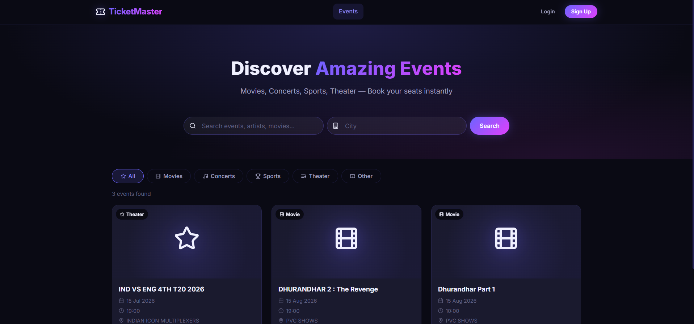

*The homepage displays all published events in a responsive card grid. Customers can search by name or city and filter by event type (Movies, Concerts, Sports, Theater, Other).*

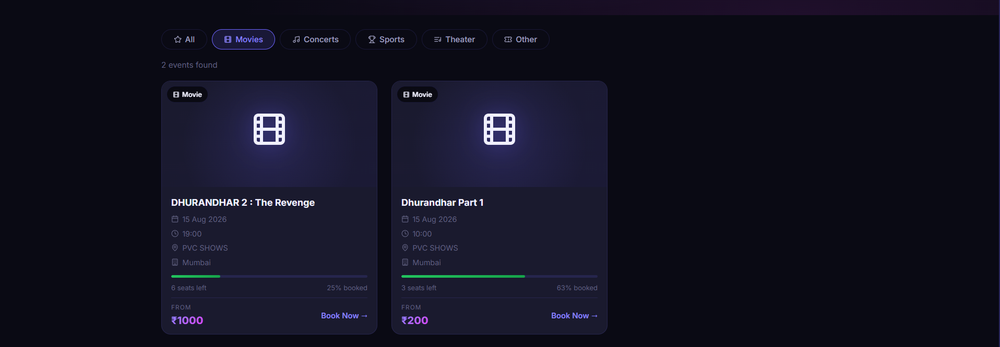

*Category filters update the event list instantly. Each card shows availability (% booked), remaining seats, and starting price.*

---

## 🌟 Core Features

### 👥 Role-Based Access Control (3 Roles)

| Role | Capabilities |
|------|-------------|
| **Admin** | Create/manage venues with custom seat layouts and categories, manage all users, view system-wide dashboard analytics, cancel any booking |
| **Organizer** | Create and edit events for assigned venues, set per-category ticket pricing, view event-specific booking analytics via organizer dashboard |
| **Customer** | Browse events, select seats via interactive visual seat map, hold and checkout seats, manage bookings, join/track waitlists |

Authentication is implemented using **JWT (Access + Refresh tokens)**. A special `ADMIN_SECRET` is required during admin registration to prevent unauthorized admin account creation.

---

### 🗺️ Interactive Visual Seat Map

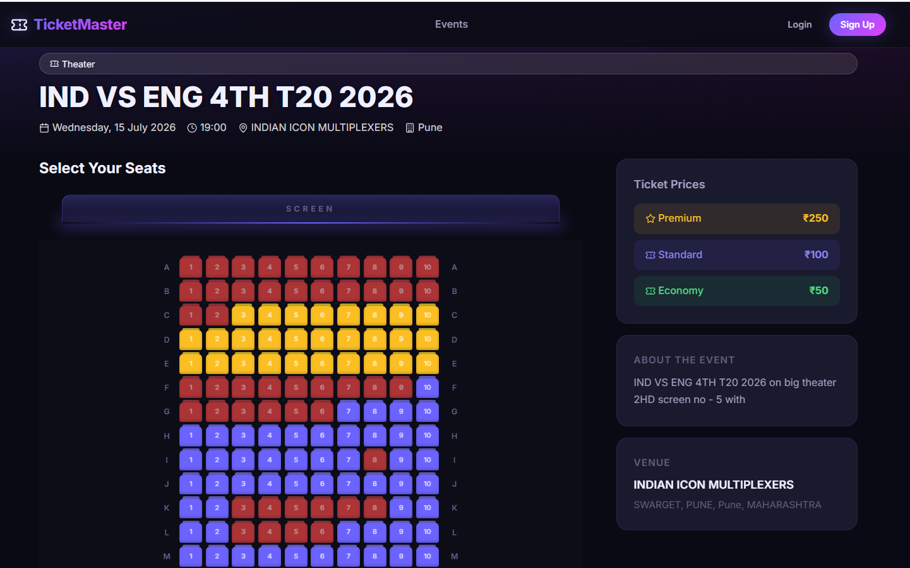

*The seat map renders every seat in the venue as a grid. Seats are colour-coded: 🔴 Booked (Red), 🟡 Premium Available (Yellow), 🔵 Standard Available (Blue), 🟢 Economy Available (Green). The right panel shows pricing per category and venue details.*

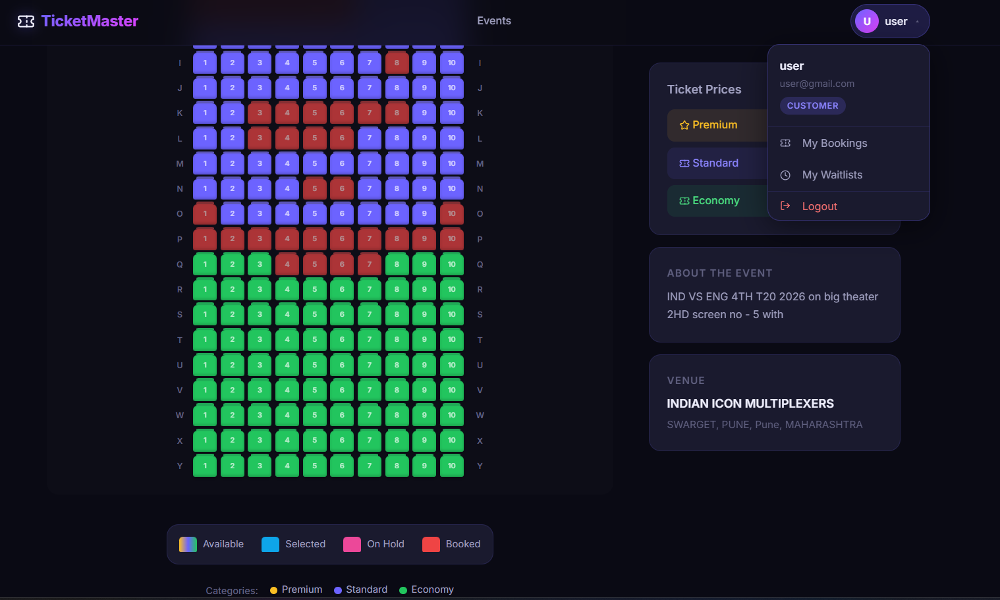

*The bottom of the seat map displays a live colour legend (Available / Selected / On Hold / Booked and Category labels). The user dropdown gives quick access to My Bookings, My Waitlists, and Logout.*

- Built entirely with **React + CSS Grid** — no external charting or canvas libraries.
- Displays a full grid of individual seats, colour-coded by category:
  - 🟡 **Premium** (Gold/Yellow)
  - 🔴 **Booked** (Red)
  - 🔵 **Standard** (Blue/Purple)
  - 🟢 **Economy** (Green)
  - 🩵 **Selected by You** (Cyan highlight)
  - ⬛ **Held by Others** (Dimmed)
- **Real-time updates via Socket.io**: When another user holds, books, or releases a seat, every other viewer's seat map updates instantly without a page refresh.
- A dynamic colour **legend** is displayed alongside the seat map.

---

### ⏱️ Seat Hold System (Concurrency Safe)

- When a customer selects seats, they are **temporarily held** for a configurable duration (default: 5 minutes, controlled by `SEAT_HOLD_TTL_MINUTES` in `.env`).
- Holds are stored in the database with a `holdExpiresAt` timestamp.
- A **Node.js Cron Job** (`seatHoldRelease.job.js`) runs every minute to automatically release expired holds, freeing them for other customers.
- MongoDB atomic `findOneAndUpdate` with a `status: 'available'` guard ensures **no double-booking** is possible under concurrent traffic.

---

### 🔖 Booking & Checkout

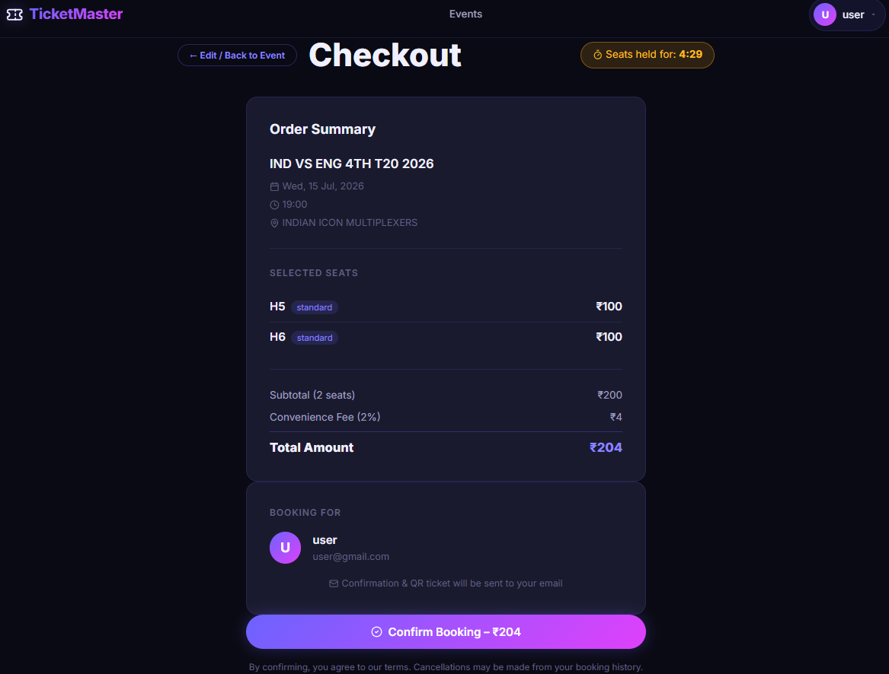

*The Checkout page displays the complete order summary: selected seats with category tags, subtotal, 2% convenience fee, and total amount. A live countdown timer (top-right) shows the remaining hold time. The user's info is confirmed before payment.*

- Checkout validates that all selected seats are still in `held` status by the requesting user, and that none have expired.
- On confirmation, a booking record is created with:
  - Subtotal (sum of seat prices)
  - **Convenience Fee (2%)** calculated automatically
  - Final amount (subtotal + fee)
  - Unique `bookingRef` (format: `TKT-XXXXXXXX`)
- Individual seat records are atomically updated to `booked` status.

---

### 🎫 Booking Confirmation & QR Code Ticket

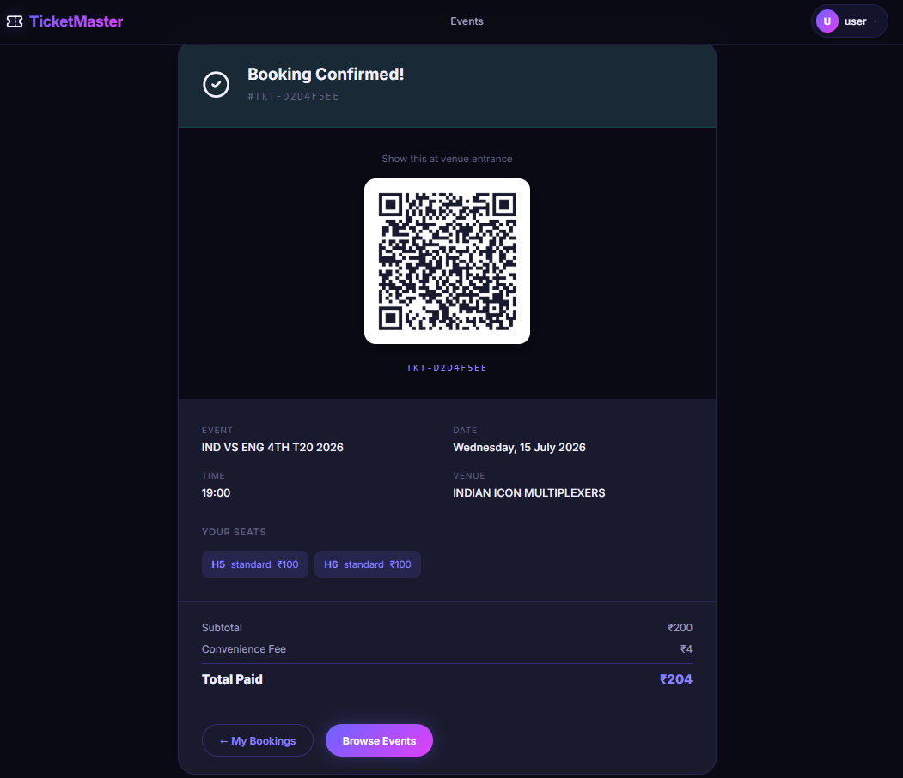

*After confirming a booking, the user sees a full booking summary with a scannable QR code. The booking reference, event details, seats, subtotal, convenience fee, and total paid are all shown. The QR code links to the public verification endpoint for use by venue staff.*

- Upon booking confirmation, a **QR code** is auto-generated using the `qrcode` library.
- The QR code encodes a public verification URL: `{SERVER_URL}/api/bookings/verify/{bookingRef}`.
- Venue staff can scan the QR code to instantly verify ticket validity via the public API endpoint.

---

### 📋 My Bookings

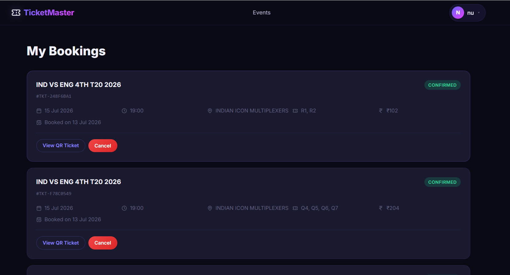

*Customers can view all past and current bookings. Each entry shows the event name, booking reference, date, time, venue, seat numbers, and total paid. Confirmed bookings have View QR Ticket and Cancel buttons.*

---

### 📧 Email Notifications (Nodemailer)

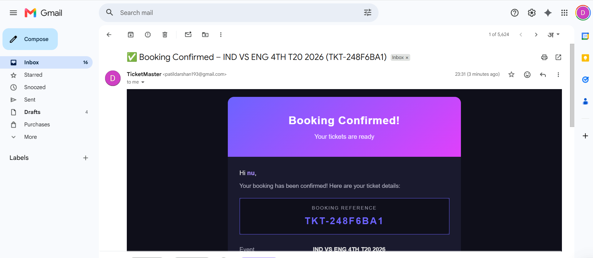

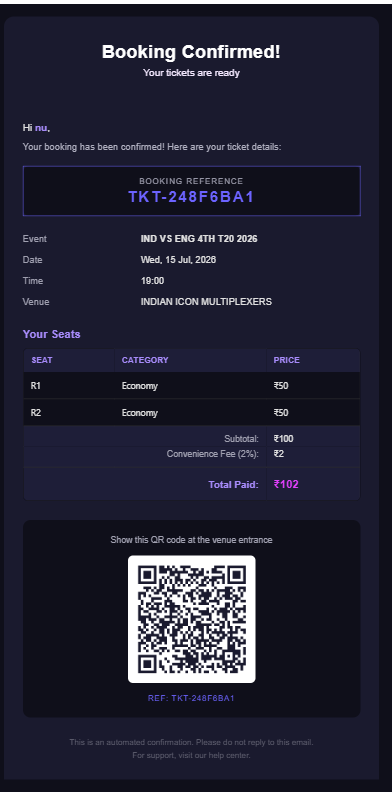

*The booking confirmation email is sent automatically after every booking. It includes the booking reference, event details, a per-seat breakdown table, subtotal, convenience fee (2%), total paid, and the QR code ticket embedded directly in the email (visible on all clients — Gmail, Outlook, and mobile).*

- **Booking Confirmation**: Sent automatically after every successful booking. Includes:
  - Event details (title, date, time, venue)
  - Seat breakdown table (seat number, category, price per seat)
  - Subtotal, Convenience Fee (2%), and Total Paid
  - QR Code ticket (embedded as an inline attachment via `Content-ID` for compatibility with Gmail, Outlook, and mobile clients)
  - Unique booking reference number
- **Waitlist Offer**: Notifies the next person in queue when a seat becomes available, with a time-limited claim link.
- **Cancellation Confirmation**: Sent when a booking is cancelled.
- Uses table-based HTML layout with inline styles for maximum cross-client rendering compatibility.

---

### 📋 Waitlist System

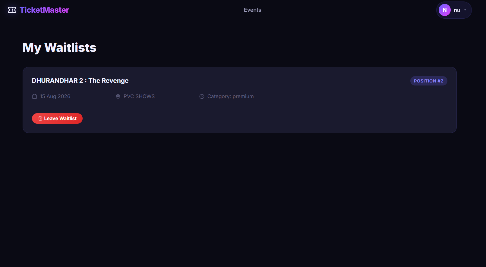

*Customers can see all their active waitlist entries. Each entry shows the event, date, venue, category, and their current position in the queue.*

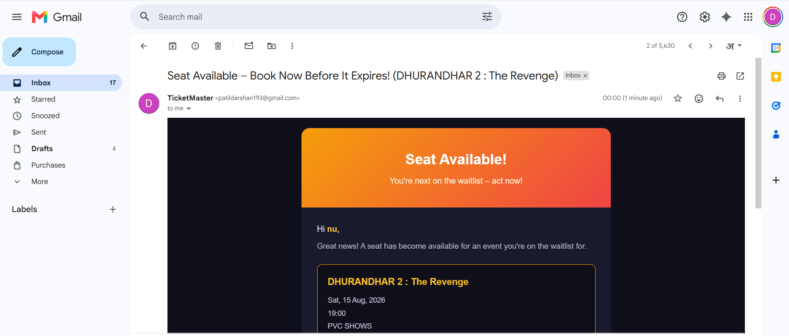

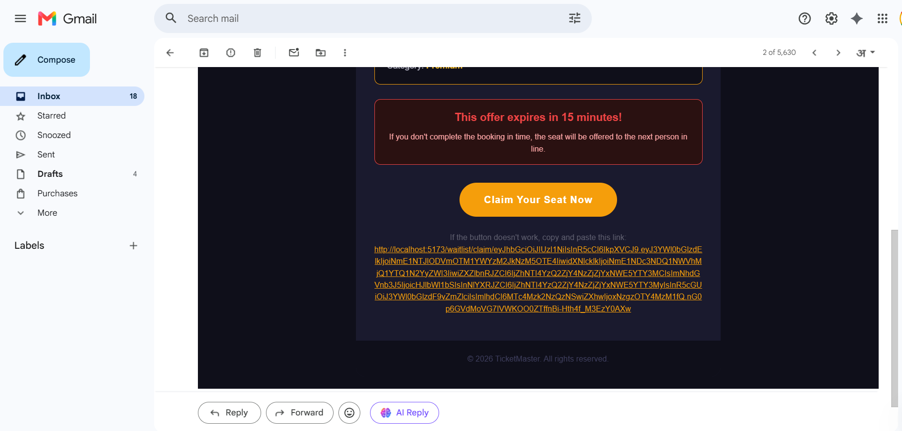

*When a seat becomes available, the next person in the waitlist queue receives a time-limited email. The email shows the event details, a red expiry warning ("This offer expires in 15 minutes!"), a "Claim Your Seat Now" button, and a fallback URL for clients where buttons may not render.*

- Customers can join a **category-specific waitlist** (Premium / Standard / Economy) for sold-out events.
- When any booking is cancelled, the backend automatically:
  1. Detects affected categories.
  2. Finds the next customer in line for that category.
  3. Sends a **secure, time-limited offer email** with a JWT-signed claim link.
  4. The claim token expires after a configurable duration (`WAITLIST_OFFER_TTL_MINUTES`).
- A separate **Waitlist Expiry Cron Job** runs every 2 minutes to clean up expired offers.

---

### 📊 Dashboards

#### Organizer Dashboard

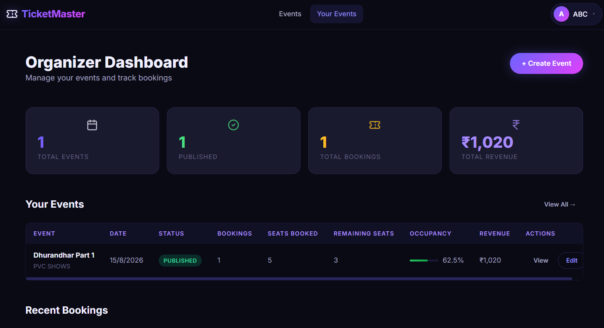

*The Organizer Dashboard provides a quick summary (Total Events, Published, Total Bookings, Total Revenue) and a detailed per-event analytics table showing bookings count, seats booked, remaining seats, occupancy percentage, and revenue. Organizers can create events directly from this page.*

#### Organizer – Create / Edit Event

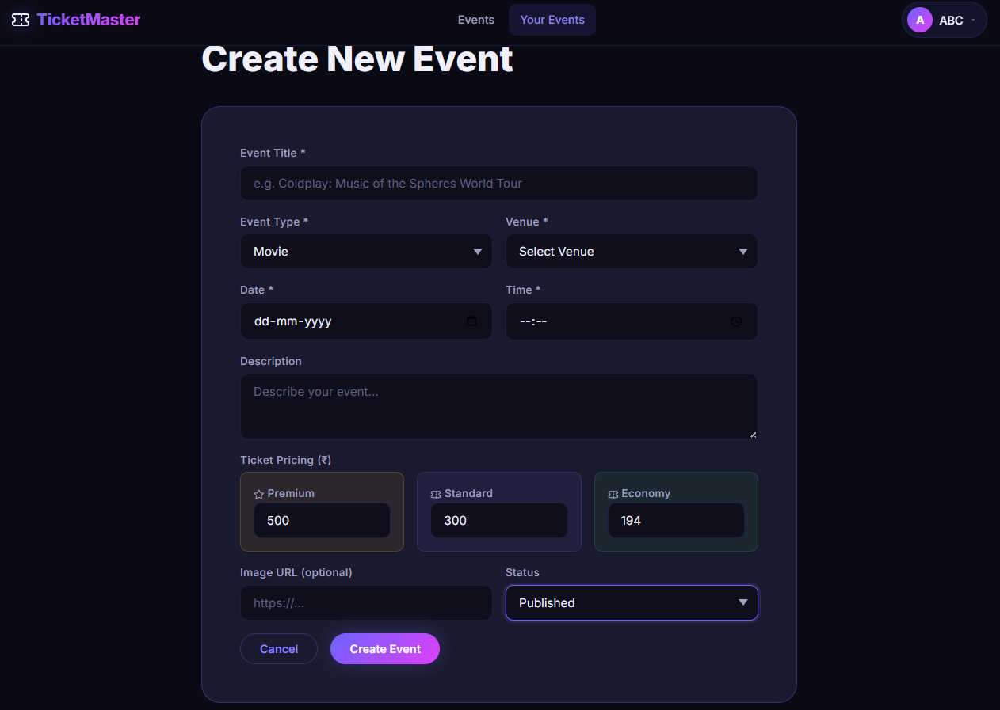

*The event creation form allows organizers to enter all event details: title, type, venue, date, time, description, per-category pricing (Premium, Standard, Economy), image URL, and status (Draft / Published). The pricing fields are context-aware — categories not present in the selected venue are automatically disabled.*

#### Admin Dashboard

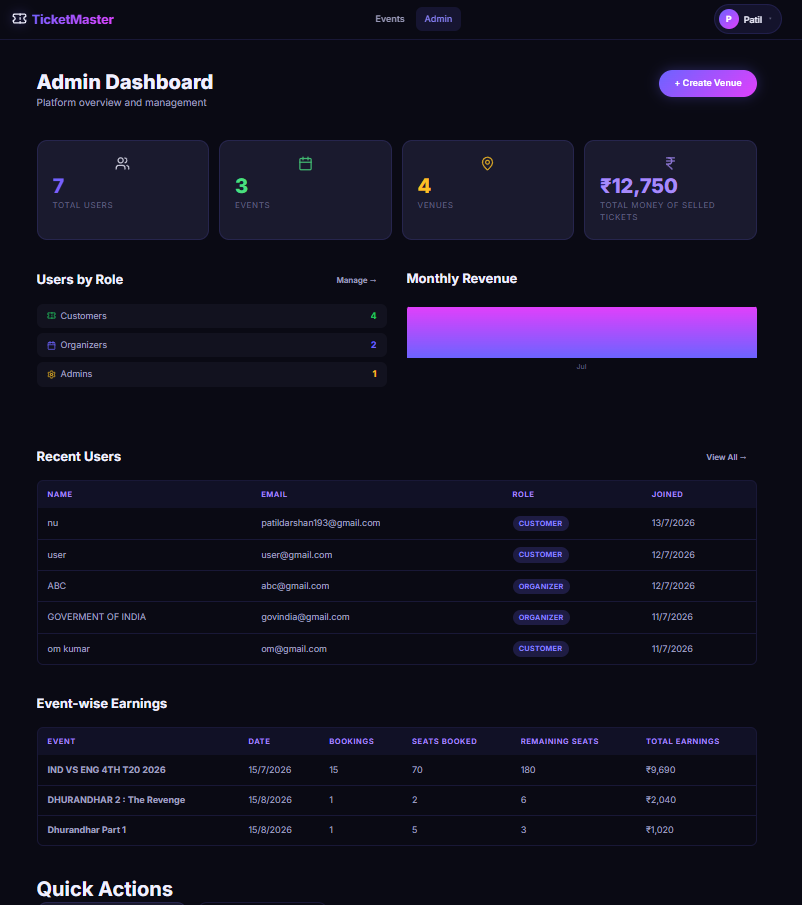

*The Admin Dashboard shows platform-wide metrics: Total Users, Events, Venues, and Total Revenue from sold tickets. It includes a Users by Role breakdown, Monthly Revenue chart, Recent Users table (with roles and join dates), and an Event-wise Earnings table.*

---

### 🎪 Venue Management (Admin Only)

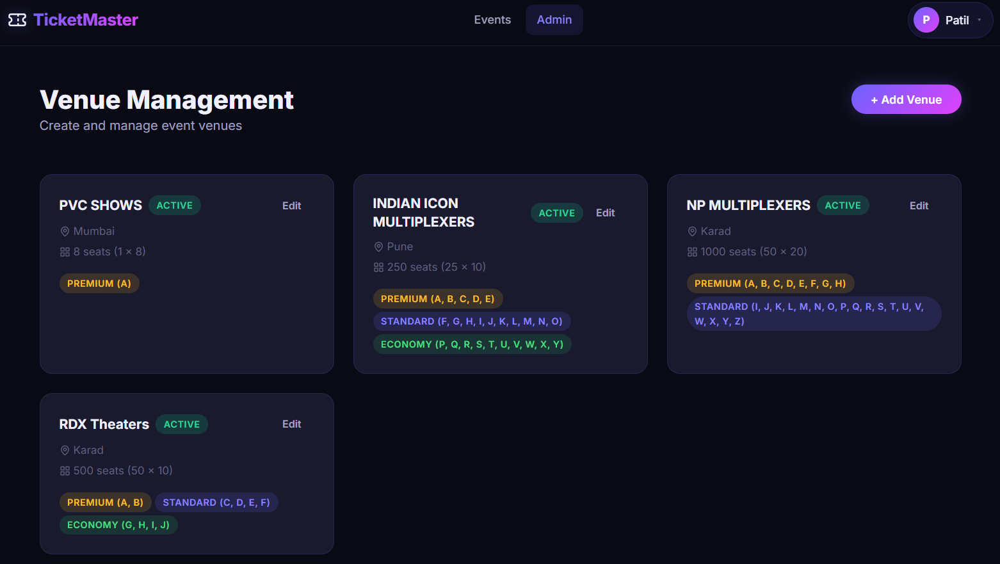

*The Venue Management page displays all registered venues as cards, each showing the venue name, location, total capacity (rows x cols), and the seat category assignments (which rows are Premium, Standard, or Economy). Venues can be edited from this view.*

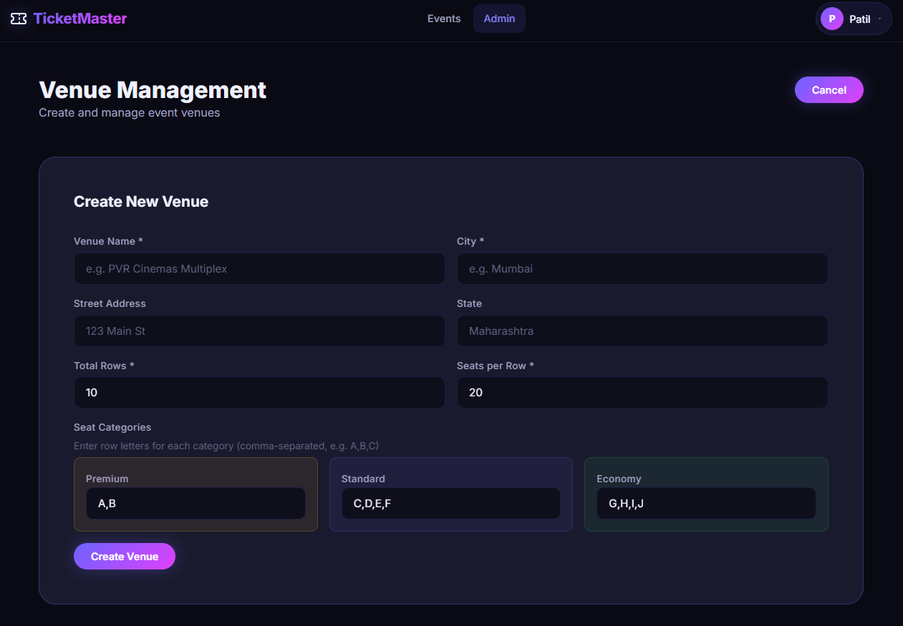

*The Add Venue form lets admins define a venue name, address, grid dimensions (Total Rows x Seats per Row), and map row letters to categories (e.g., A,B = Premium, C,D,E,F = Standard, G,H,I,J = Economy). The total capacity is automatically calculated.*

- Create venues with:
  - Name and full address (street, city, state, country, pincode)
  - Grid dimensions (`totalRows` x `totalCols`)
  - `totalCapacity` is auto-calculated on save.
  - Seat categories (Premium / Standard / Economy) with assigned **row labels** (e.g., rows A-C = Premium, D-G = Standard, H-L = Economy).
  - Optional amenities list.

---

### 🔔 Real-time Notifications (Socket.io)

- A persistent Socket.io connection is maintained throughout the user session via a React `SocketContext`.
- Events emitted:
  - `seat:held` – when a seat is held by any user
  - `seat:booked` – when a seat is confirmed
  - `seat:released` – when a hold expires or is cancelled
  - `booking:cancelled` – for real-time UI updates on cancellations

---

## 🛠️ Technology Stack

### Backend
| Package | Purpose |
|---------|---------|
| `express` | HTTP API server |
| `mongoose` | MongoDB ODM |
| `socket.io` | Real-time WebSocket events |
| `jsonwebtoken` | JWT auth (access + refresh tokens) |
| `bcryptjs` | Password hashing |
| `nodemailer` | Transactional email |
| `qrcode` | QR code generation |
| `node-cron` | Scheduled jobs (hold release, waitlist expiry) |
| `express-validator` | Input validation |
| `helmet` | HTTP security headers |
| `morgan` | HTTP request logging |
| `compression` | Response compression |
| `uuid` | Booking reference generation |
| `nodemon` | Dev auto-restart |

### Frontend
| Package | Purpose |
|---------|---------|
| `react` | UI framework |
| `react-router-dom` | Client-side routing |
| `axios` | HTTP API client |
| `socket.io-client` | Real-time socket connection |
| `react-hook-form` | Form state & validation |
| `react-hot-toast` | Toast notifications |
| `react-icons` | Icon library |
| `vite` | Build tool & dev server |

---

## 🔑 API Endpoints Overview

| Method | Endpoint | Access | Description |
|--------|----------|--------|-------------|
| POST | `/api/auth/register` | Public | Register new user (customer/organizer/admin) |
| POST | `/api/auth/login` | Public | Login, returns access + refresh tokens |
| POST | `/api/auth/refresh` | Public | Refresh access token |
| GET | `/api/events` | Public | List all published events |
| GET | `/api/events/:id` | Public | Get event details |
| POST | `/api/events` | Organizer/Admin | Create event |
| PUT | `/api/events/:id` | Organizer/Admin | Update event |
| GET | `/api/events/:id/seats` | Auth | Get seat map for event |
| POST | `/api/seats/hold` | Customer | Hold selected seats |
| DELETE | `/api/seats/release` | Customer | Release held seats |
| POST | `/api/bookings` | Customer | Confirm booking from held seats |
| GET | `/api/bookings/my` | Customer | Get own booking history |
| GET | `/api/bookings/:id` | Auth | Get booking details |
| DELETE | `/api/bookings/:id` | Auth | Cancel booking |
| GET | `/api/bookings/verify/:bookingRef` | Public | Verify QR ticket (for venue staff) |
| GET | `/api/venues` | Auth | List all venues |
| POST | `/api/venues` | Admin | Create venue |
| PUT | `/api/venues/:id` | Admin | Update venue |
| POST | `/api/waitlist/join` | Customer | Join event category waitlist |
| GET | `/api/waitlist/my` | Customer | Get own waitlist entries |
| POST | `/api/waitlist/claim/:token` | Customer | Claim a waitlist seat offer |
| GET | `/api/dashboard/organizer` | Organizer/Admin | Organizer analytics |
| GET | `/api/dashboard/admin` | Admin | Admin system analytics |
